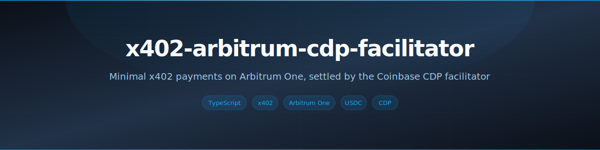
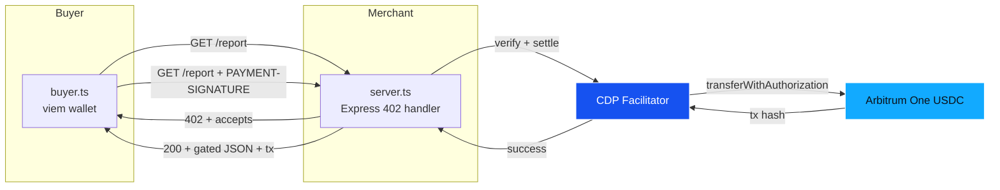
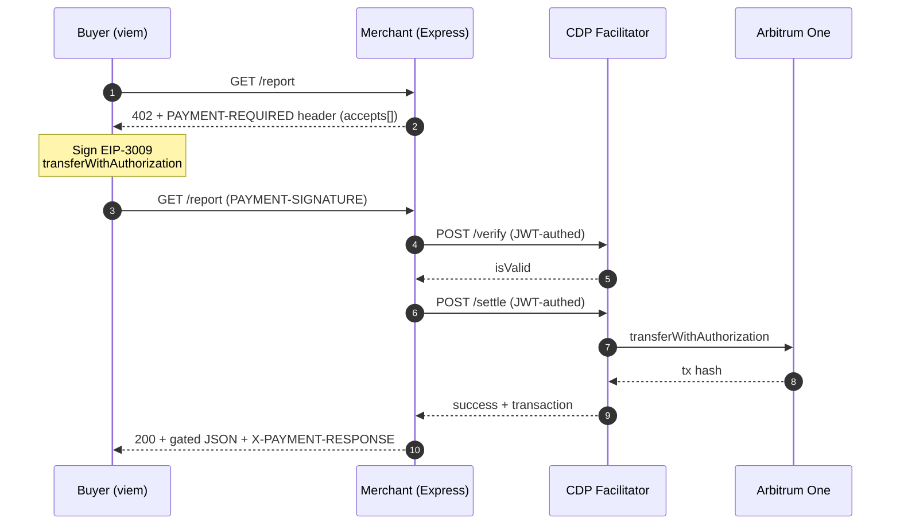

<!-- Banner -->
<p align="center">
  
</p>

<!-- Badges -->
<p align="center">
  <a href="LICENSE"></a>
  <a href="https://nodejs.org/"></a>
  <a href="https://www.typescriptlang.org/"></a>
  <a href="https://viem.sh/"></a>
  <a href="https://www.x402.org/"></a>
  <a href="https://arbitrum.io/"></a>
  <a href="#contributing"></a>
</p>

<!-- One-liner + nav -->
<p align="center">
  <strong>An x402 v2 example on Arbitrum One: an HTTP merchant returns <code>402</code>, a viem wallet pays, and the Coinbase CDP facilitator settles USDC.</strong>
  <br>
  <a href="https://www.x402.org/">x402 Protocol</a> · <a href="#quick-start">Quick Start</a>
</p>

## What it does

- **Returns** an x402 v2 `402 Payment Required` from an Express route, advertising price, asset, and payee.
- **Signs** an EIP-3009 `transferWithAuthorization` on the buyer with a local viem wallet.
- **Verifies and settles** each payment through the Coinbase CDP facilitator, which submits the transfer on Arbitrum One.
- **Serves** the gated JSON only after settlement, returning the on-chain transaction hash to the buyer.
- **Calls** the 402, CDP JWT auth, and `/verify` + `/settle` directly rather than through middleware.

## Quick Start

```bash
pnpm install
cp .env.example .env
# Edit .env. Server: RECIPIENT_ADDRESS, CDP_API_KEY_ID, CDP_PRIVATE_KEY
#            Buyer:  BUYER_PRIVATE_KEY (a funded Arbitrum One wallet holding USDC)

pnpm serve   # terminal 1: starts the merchant on http://localhost:4021/report
pnpm buy     # terminal 2: pays and prints the gated content + Arbiscan link
```

## Architecture



## End-to-end flow



## Stack

| Layer | Tool |
|:------|:-----|
| Language | TypeScript, run with `tsx` on Node 20+ |
| Merchant | Express |
| Buyer wallet | viem local account (`privateKeyToAccount`) |
| x402 client | `@x402/fetch` + `@x402/evm` (protocol v2) |
| Wire codec | `@x402/core/http` header encode/decode |
| Settlement | Coinbase CDP facilitator (`/platform/v2/x402`) |
| Chain | Arbitrum One (CAIP-2 `eip155:42161`) |
| Asset | Native USDC (`0xaf88d065e77c8cC2239327C5EDb3A432268e5831`) |

<details>
<summary><strong>Prerequisites</strong></summary>

- [Node.js](https://nodejs.org/) 20+ and [pnpm](https://pnpm.io/).
- A [Coinbase Developer Platform](https://portal.cdp.coinbase.com/) API key (`id` + `privateKey`) for the merchant to authenticate to the facilitator.
- An EVM wallet funded with **USDC on Arbitrum One** for the buyer. Only the private key is needed. The facilitator submits the on-chain transfer, so the buyer wallet does not need ETH for gas.
- A `RECIPIENT_ADDRESS` to receive the USDC.

</details>

## Configuration

All configuration is via `.env` (see [`.env.example`](.env.example)):

| Variable | Side | Purpose |
|:---------|:-----|:--------|
| `RECIPIENT_ADDRESS` | server | EVM address that receives USDC |
| `PRICE_USDC` | server | Price per request in base units (6 decimals); `10000` = `$0.01` |
| `PORT` | server | Merchant listen port (default `4021`) |
| `CDP_API_KEY_ID` | server | CDP API key id |
| `CDP_PRIVATE_KEY` | server | CDP API key (Ed25519 raw base64 or EC PEM) |
| `BUYER_PRIVATE_KEY` | buyer | Private key of the funded Arbitrum One wallet |
| `RESOURCE_URL` | buyer | Merchant endpoint to pay (default `http://localhost:4021/report`) |

## Usage

Start the merchant, then run the buyer against it:

```bash
$ pnpm buy
GET http://localhost:4021/report
  paying from 0xYourBuyer... on eip155:42161

Status: 200
Body:
{
  "resource": "premium-market-data",
  "asOf": "2026-05-28T07:22:17.000Z",
  "payload": { "btc": 71234.56, "eth": 4567.89 },
  "_payment": {
    "txHash": "0x...",
    "network": "eip155:42161",
    "arbiscan": "https://arbiscan.io/tx/0x..."
  }
}

Settled on-chain: https://arbiscan.io/tx/0x...
```

You can also see the raw 402 with no wallet at all:

```bash
curl -i http://localhost:4021/report
```

## Project structure

```
.
├── src/
│   ├── networks.ts      # Arbitrum One + CDP facilitator constants
│   ├── x402.ts          # builds the x402 v2 PaymentRequired
│   ├── cdp-jwt.ts       # short-lived CDP API JWT minting (Ed25519 / EC)
│   ├── facilitator.ts   # explicit /verify + /settle calls
│   ├── server.ts        # Express merchant: 402 -> verify -> settle -> content
│   └── buyer.ts         # viem wallet + x402 pay/retry client
├── .github/banner.svg
├── .env.example
├── package.json
└── tsconfig.json
```

## Contributing

PRs welcome. Open an issue first for anything non-trivial.

## License

MIT. See [LICENSE](LICENSE).
